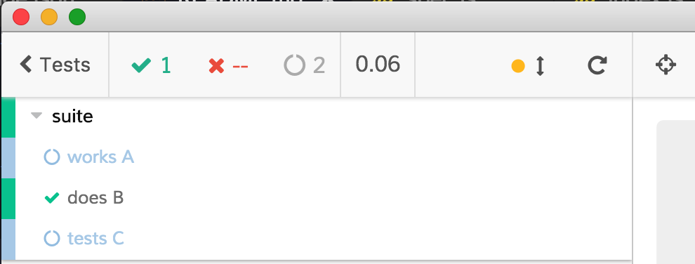

# cypress-select-tests-example [![Build status][ci-image]][ci-url] [![renovate-app badge][renovate-badge]][renovate-app]

> Example using [cypress-select-tests](https://github.com/bahmutov/cypress-select-tests) to run only some tests

See [cypress/plugins/index.js](cypress/plugins/index.js). In this test we only allow tests with the string "does" in the title. Thus other tests are automatically skipped.



When running in headless mode `npx cypress run` only a single test runs too

```text
  Running: spec.js...    (1 of 1)
picking tests from file cypress/integration/spec.js
found tests
[ [ 'suite', 'works A' ],
  [ 'suite', 'does B' ],
  [ 'suite', 'tests C' ] ]


  suite
    - works A
    ✓ does B (38ms)
    - tests C


  1 passing (81ms)
  2 pending
```

## Links

- [www.cypress.io](https://www.cypress.io)
- [cypress-select-tests](https://github.com/bahmutov/cypress-select-tests)
- [cypress-example-recipes](https://github.com/cypress-io/cypress-example-recipes)

[ci-image]: https://circleci.com/gh/bahmutov/cypress-select-tests-example.svg?style=svg
[ci-url]: https://circleci.com/gh/bahmutov/cypress-select-tests-example
[renovate-badge]: https://img.shields.io/badge/renovate-app-blue.svg
[renovate-app]: https://renovateapp.com/
